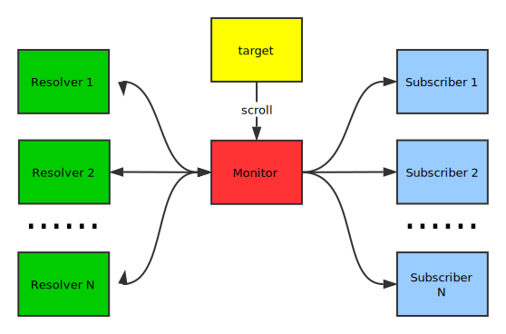
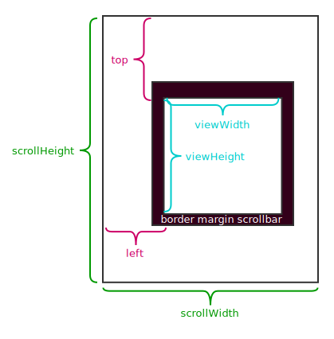

# scroll-monitor
[](https://www.browserstack.com/automate/public-build/alhUZjJoT011bjkxWURzRUcrYm5TclNRRnVVL090Ulk5ODlrczNHUjB1QT0tLWFrNW9YbkdFMEwrTlI0RkZmQ1NoV2c9PQ==--3a4c5f45c55eb7fb7e942937938a217444f5c16a)
[](https://travis-ci.org/swgrhck/scroll-monitor)
[](https://coveralls.io/github/swgrhck/scroll-monitor?branch=master)

This is a JavaScript plugin that monitors and responds to scroll event, and supports the usage via data attributes to separate html from script.

[TOC]

## Introduction

The topology of scroll-monitor is illustrated as follow:



Every `Monitor` has a `target`, when `target` scrolls, `Monitor` will receive scrolling events dispatched by `target`. `Monitor` can register `Resolver`s, which can resolve scrolling events delivered by `Monitor` and convert scroll events to other events, such as scrolling up events, and then return converted events to `Monitor`. `Monitor` will dispatch converted events to `Subscriber`s when receiving, so `Subscriber`s can respond to certain scrolling events, such as executing some JavaScript when target scrolls up.

So, the processing procedure is as follow:

1. `target` scrolls.
2. `Monitor` receives scrolling events and delivers to `Resolver`s.
3. `Resolver`s resolve scrolling events, convert to other events and return to `Monitor`.
4. `Monitor` receives converted events and dispatchs to `Subscriber`s.
5. `Subscriber`s can respond to classified scrolling events, such as scrolling up.

## Installation

Include `scroll-monitor.umd.min.js` script, or standalone JS files, such as `monitor.min.js`, if you only want to use partial components:

```html
<script src="scroll-monitor.umd.min.js"></script>

<!-- or if you only want to use partial components -->
<script src="monitor.min.js"></script>
<!-- other components -->
```

## Monitor

The core component of this plugin is `Monitor`, which monitors scroll events of targets, resolves `ScrollMetric` of target, delivers `ScrollMetric`s and scrolling events to `Resolver`s, then dispatchs converted events to subscribers, so subscribers can listen to classified scroll event, such as scrolling up. See follow charpter for more information about `ScrollMetric`.

### By data attributes

The easiest and preferred way to subscribe to `Monitor` is by data attribute `data-monitor="scroll"`:

```html
<div data-monitor="scroll"></div>
```

The `div` above will monitor scroll events of `window`, so when window scrolls, `Monitor` will dispatch events converted by `Resolver`s  to this `div`.

You can also specify the targets of `Monitor` by data attribute `data-monitor-target="<querySelector>"`:

```html
<div class="monitored">
  <div data-monitor="scroll" data-monitor-target=".monitored"></div>
</div>
```

Now the `div` will monitor scroll events of all elements with class `monitored`.

### By JavaScript

The other way to subscribe to `Monitor` is by JavaScript:

```javascript
const Monitor = window.Monitor || window.scrollMonitor.Monitor
let monitor = Monitor.of(target)
monitor.subscribe(subscriber)
```

You can invoke `Monitor.of(target)` to get the monitor of target, and then subscribe subscriber by invoking `monitor.subscribe(subscriber)`.

> The target must be an instance of [Window](https://developer.mozilla.org/en-US/docs/Web/API/Window) or [Element](https://developer.mozilla.org/en-US/docs/Web/API/Element).
>
> The subscriber must be an instance of [EventTarget](https://developer.mozilla.org/en-US/docs/Web/API/EventTarget).

### Register Resolvers

`Monitor` can register `Resolver`s to resolve scrolling events, there are two ways to register `Resolver`s:

1. register as a global `Resolver` to all `Monitor`s.

   ```javascript
   const resolver = someResolver()
   Monitor.registerResolver(resolver)
   ```

2. register as certain `Monitor`'s own `Resolver`.

   ```javascript
   const resolver = someResolver()
   Monitor.of(target).registerResolver(resolver)
   ```

The only requirement of `Resolver` is it must have a `resolve` function returing an array of `Event`s:

```javascript
const customResolver = {
  resolve(lastMetric, crtMetric, event) {
    const events = []
    // resolve and add converted events
    return events
  }
}

Monitor.registerResolver(customResolver)
// or
Monitor.of(target).registerResolver(customResolver)
```

### ScrollMetric

`ScrollMetric` contains some scrolling metric about target, including 6 read-only properties:

1. `scrollHeight`: a measurement of the height of an element's content, including content not visible on the screen due to overflow. 
2. `scrollWidth`: a measurement of the width of an element's content, including content not visible on the screen due to overflow. 
3. `viewHeight`: zero for elements with no CSS or inline layout boxes, otherwise it's the inner height of an element in pixels, including padding but not the horizontal scrollbar height, border, or margin. 
4. `viewWidth`: zero for elements with no CSS or inline layout boxes, otherwise it's the inner width of an element in pixels. It includes padding but not the vertical scrollbar (if present, if rendered), border or margin. 
5. `top`: a measurement of the distance from the element's top to its topmost *visible* content. 
6. `left`: a measurement of the distance from the element's left to its leftmost *visible* content. 

The following figure illustrates the properties of `ScrollMetric`:



## Scroll Direction Resolver

`ScrollDirectionResolver` is a resolver registered to `Monitor`, which can resolve scrolling events to recognize the scrolling direction.

If you include `scroll-monitor.umd.min.js` or `scroll-monitor-direction.min.js`, it will register a global `ScrollDirectionResolver` to all `Monitor`s when `document` is ready.

### By data attributes

The easiest and preferred way to use `ScrollDirectionResolver` is by data attribute `data-monitor="scroll-direction"`:

```html
<div data-monitor="scroll scroll-direction"></div>
```

The `div` above will monitor scrolling events of `window`, and toggle the classes according to scroll direction, by default, none classes will be toggled, you should specify the classes by data attributes:

* `data-scroll-up-classes="<class>"`
* `data-scroll-down-classes="<class>"`
* `data-scroll-left-classes="<class>"`
* `data-scroll-right-classes="<class>"`

You can specify multiple classes to be toggled by separating classes with spaces. For example:

```html
<div data-monitor="scroll scroll-direction" data-scroll-up-classes="up scroll"></div>
```

Now when window scrolls up, the `div` will toggle class `up` and `scroll`.

See [demo](http://swgrhck/github.io/scroll-monitor/demo/scroll-direction-by-data.html).

### By JavaScript

The other way to use `ScrollDirectionResolver` is by Javascript. When target scrolls, `ScrollDirectionResolver` will resolve and dispatch 4 kinds of events:

* `scroll.up.scroll-monitor` when target scrolls up.

* `scroll.down.scroll-monitor` when target scrolls down.

* `scroll.left.scroll-monitor` when target scrolls left.

* `scroll.right.scroll-monitor` when target scrolls right.

This means that you can add event listeners to subscribers to do anything you want:

```javascript
Monitor.of(window).subscribe(window)

window.addEventListener('scroll.up.scroll-monitor', event => {
  // anything you want to do
})
```

See [demo](http://swgrhck/github.io/scroll-monitor/demo/scroll-direction-by-script.html).

### Processing interval

Since `scroll` events can fire at a high rate, so `ScrollDirectionResolver` have a time interval to recognize direction, which defaults to `50ms`. You can get or set interval by `resolver.inteval`, or set `interval` when creating resolver by `new ScrollDirectionResolver(inteval)`.

```javascript
const resolver = new ScrollDirectionResolver(interval)
resolver.interval = interval
```

## Extend ScrollMonitor

The `ScrollMonitor` is flexible and pluggable, this means you can extend `ScrollMonitor` easily if present components can't satisfy your needs, the only thing you should do is register your own `Resolver` to `Monitor`:

```javascript
const customResolver = {
  resolve(lastMetric, crtMetric, event) {
    const events = []
    // resolve and add converted events
    return events
  }
}

Monitor.registerResolver(customResolver)
// or
Monitor.of(target).registerResolver(customResolver)
```

The `resolve` function of `Resolver` receives 3 arguments:

1. `lastMetric`: the `ScrollMetric` before target scrolls.
2. `crtMetric `: the `ScrollMetric` after target scrolls.
3. `event`: the origin scroll event emitted by target.

Once you register your own `Register`, you can add `EventListener` to subscribers so that they can respond to events conveted by yourself properly.

## Browser support

[](http://browserstack.com/)

[BrowserStack](https://www.browserstack.com/) is a cross browser and real device web-based testing platform. BrowserStack can be used for interactive as well as automated testing through frameworks like Selenium, Karma and others.

This plugin is tested on multiple platforms and browsers under supports of [BrowserStack](https://www.browserstack.com/):

* Windows
* Mac OS
* Android
* Chrome
* Firefox
* Safari
* Microsoft Edge

## License

The plugin is available as open source under the terms of the [MIT License](https://opensource.org/licenses/MIT).
