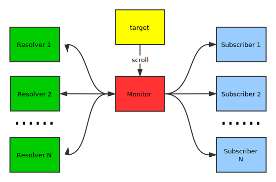
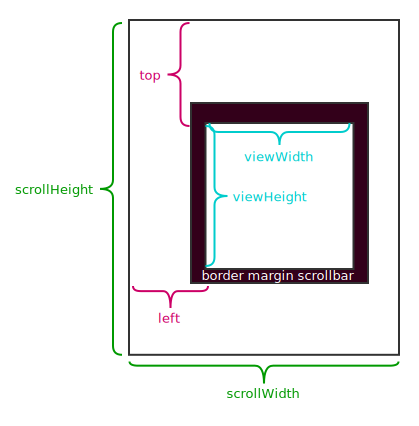

# scroll-monitor
[](https://www.browserstack.com/automate/public-build/alhUZjJoT011bjkxWURzRUcrYm5TclNRRnVVL090Ulk5ODlrczNHUjB1QT0tLWFrNW9YbkdFMEwrTlI0RkZmQ1NoV2c9PQ==--3a4c5f45c55eb7fb7e942937938a217444f5c16a)
[](https://travis-ci.org/swgrhck/scroll-monitor)
[](https://coveralls.io/github/swgrhck/scroll-monitor?branch=master)

这是一个用于监听并响应滚动事件的插件，支持通过数据属性的用法来分离html和script。

[TOC]

## 介绍

scroll-monitor的拓扑图如下所示：



每个 `Monitor` 都有一个 `target`, 当 `target` 滚动时，`Monitor` 会接收到 `target` 发送的滚动事件。`Monitor` 可以注册 `Resolver`, 用于解析 `Monitor` 转发的滚动事件，并将滚动事件转换为其他事件，例如向上滚动事件，然后将这些转换的事件返回给 `Monitor`。 `Monitor` 会将转换的事件发送给 `Subscriber`，所以 `Subscriber` 就可以对某些滚动事件进行响应，比如当目标向上滚动时执行某些JavaScript。

所以，处理的步骤如下：

1. `target` 滚动。
2. `Monitor` 接受到滚动事件并发送给 `Resolver`.
3. `Resolver` 解析滚动事件，转换为其他事件，并返回给 `Monitor`.
4. `Monitor` 接受到转换的事件然后转发给 `Subscriber`.
5. `Subscriber` 可以对分类的滚动事件进行响应，例如向上滚动事件。

## 安装

导入`scroll-monitor.umd.min.js` 脚本文件, 或者如果你只想要使用部分组件，可以导入单独的脚本文件，比如 `monitor.min.js`。

```html
<script src="scroll-monitor.umd.min.js"></script>

<!-- 或者如果你只想要使用部分组件 -->
<script src="monitor.min.js"></script>
<!-- 其他组件 -->
```

## Monitor

这个插件的核心组件 `Monitor`, 它用于监听目标的滚动事件，解析目标的 `ScrollMetric` ，转发 `ScrollMetric` 以及滚动事件给 `Resolver`， 然后转发转换的事件给 `Subscriber`， 所以 `Subscriber` 可以监听分类的滚动事件，比如向上滚动。更多关于 `ScrollMetric` 的信息请查看后续章节。

### 数据属性用法

最简单且最推荐的订阅 `Monitor` 的方法是通过数据属性 `data-monitor="scroll"`：

```html
<div data-monitor="scroll"></div>
```

上面的 `div` 将会监听 `window` 的滚动事件，当 `window` 时，`Monitor` 会分发 `Resolver` 转换的事件给这个 `div`。

你可以通过数据属性 `data-monitor-target="<querySelector>"` 来指定 `Monitor` 的目标：

```html
<div class="monitored">
  <div data-monitor="scroll" data-monitor-target=".monitored"></div>
</div>
```

现在 `div` 会监听所有拥有类 `monitored` 的元素的滚动事件。

### JavaScript用法

另一种订阅 `Monitor` 的方法是通过JavaScript：

```javascript
const Monitor = window.Monitor || window.scrollMonitor.Monitor
let monitor = Monitor.of(target)
monitor.subscribe(subscriber)
```

你可以通过调用 `Monitor.of(target)` 来获得目标的 `Monitor`，然后通过调用 `monitor.subscribe(subscriber)` 来添加订阅者。

> 目标必须是[Window](https://developer.mozilla.org/en-US/docs/Web/API/Window)或者[Element](https://developer.mozilla.org/en-US/docs/Web/API/Element)的实例。
>
> 订阅者必须是[EventTarget](https://developer.mozilla.org/en-US/docs/Web/API/EventTarget)的实例。

### 注册Resolver

`Monitor` 可以注册 `Resolver`s 来解析滚动事件，这里有两种方法来进行注册：

1. 注册到所有 `Monitor` ：

   ```javascript
   const resolver = someResolver()
   Monitor.registerResolver(resolver)
   ```

2. 注册到某个 `Monitor` ：

   ```javascript
   const resolver = someResolver()
   Monitor.of(target).registerResolver(resolver)
   ```

The only requirement of `Resolver` is it must have a `resolve` function returing an array of `Event`s:

`Resolver` 唯一的要求是它必须有一个方法名为 `resolve`，返回 `Event` 数组：

```javascript
const customResolver = {
  resolve(lastMetric, crtMetric, event) {
    const events = []
    // resolve and add converted events
    return events
  }
}

Monitor.registerResolver(customResolver)
// 或者
Monitor.of(target).registerResolver(customResolver)
```

### ScrollMetric

`ScrollMetric` 包含一些关于目标的滚动指标，有6个只读属性：

1. `scrollHeight`: 元素内容高度的度量，包括由于溢出而在屏幕上不可见的内容。
2. `scrollWidth`: 元素内容宽度的度量，包括由于溢出而在屏幕上不可见的内容。
3. `viewHeight`: 没有CSS或内联布局框的元素为零，否则为元素的内部高度（以像素为单位），包括填充，但不包括水平滚动条高度，边框或边距。
4. `viewWidth`: 没有CSS或内联布局框的元素为零，否则它是以像素为单位的元素内部宽度。 它包括填充，但不包括垂直滚动条（如果存在，如果呈现），边框或边距。
5. `top`: 从元素顶部到最顶层可见内容的距离的度量。
6. `left`: 测量从元素左侧到其最左侧可见内容的距离。

下图说明了 `ScrollMetric` 的属性：



## Scroll Direction Resolver

`ScrollDirectionResolver` 是一个注册到 `Monitor` 的解析器，它可以解析滚动事件来识别滚动方向。

如果你包含 `scroll-monitor.umd.min.js ` 或 `scroll-monitor-direction.min.js`，则当网页文档就绪时，它将向全部 `Monitor` 注册 `ScrollDirectionResolver` 。

### 数据属性用法

使用 `ScrollDirectionResolver` 的最简单和首选的方法是通过数据属性 `data-monitor="scroll-direction"`：

```html
<div data-monitor="scroll scroll-direction"></div>
```

上面的div将监视窗口的滚动事件，并根据滚动方向切换类，默认情况下，没有类将被切换，你可以通过数据属性指定要切换的类：

* `data-scroll-up-classes="<class>"`
* `data-scroll-down-classes="<class>"`
* `data-scroll-left-classes="<class>"`
* `data-scroll-right-classes="<class>"`

可以通过用空格分隔要切换的多个类，例如：

```html
<div data-monitor="scroll scroll-direction" data-scroll-up-classes="up scroll"></div>
```

现在，当窗口向上滚动时， `div` 将切换类 `up` 和 `scroll` 。

查看 [demo](http://swgrhck.github.io/scroll-monitor/demo/scroll-direction-by-data.html).

### JavaScript用法

另一种使用 `ScrollDirectionResolver` 的方法是使用JavaScript。 当目标滚动时， `ScrollDirectionResolver` 将解析和分发4种事件：

* `scroll.up.scroll-monitor` 当目标向上滚动。

* `scroll.down.scroll-monitor` 当目标向下滚动。

* `scroll.left.scroll-monitor` 当目标向左滚动。

* `scroll.right.scroll-monitor` 当目标向右滚动。

这意味着可以将事件侦听器添加到订阅者以执行任何想要的操作：

```javascript
Monitor.of(window).subscribe(window)

window.addEventListener('scroll.up.scroll-monitor', event => {
  // anything you want to do
})
```

查看 [demo](http://swgrhck.github.io/scroll-monitor/demo/scroll-direction-by-script.html).

### 处理间隔

由于滚动事件可以触发频率很高，所以 `ScrollDirectionResolver` 设置了一个时间间隔来识别方向，默认为 `50ms`。 可以通过 `resolver.inteval` 获取或设置时间间隔，或者通过 `new ScrollDirectionResolver(inteval)` 创建解析器时设置时间间隔。

```javascript
const resolver = new ScrollDirectionResolver(interval)
resolver.interval = interval
```

## 扩展ScrollMonitor

 `ScrollMonitor` 具有灵活性和可插拔性，这意味着如果当前的组件无法满足你的需求，你可以轻松扩展 `ScrollMonitor` ，唯一需要做的就是将自己的 `Resolver` 注册到 `Monitor`：

```javascript
const customResolver = {
  resolve(lastMetric, crtMetric, event) {
    const events = []
    // 解析并将转换的事件添加到events
    return events
  }
}

Monitor.registerResolver(customResolver)
// 或者
Monitor.of(target).registerResolver(customResolver)
```

 `Resolver` 的 `resolve` 函数接收3个参数：

1. `lastMetric`: 目标滚动前的 `ScrollMetric` 。
2. `crtMetric `: 目标滚动后的 `ScrollMetric` 。
3. `event`: 目标发出的原始滚动事件。

一旦你注册了你自己的 `Register`，你可以添加订阅者的 `EventListener `，以便他们能够正确响应你自己转换的事件。

## 浏览器支持

[](http://browserstack.com/)

[BrowserStack](https://www.browserstack.com/)是一个基于Web的跨浏览器的使用真实设备的测试平台。 [BrowserStack](https://www.browserstack.com/)可用于交互式或者通过Selenium，Karma等框架进行自动化测试。

该插件在[BrowserStack](https://www.browserstack.com/)的支持下在多个平台和浏览器上进行测试：

* Windows
* Mac OS
* Android
* Chrome
* Firefox
* Safari
* Microsoft Edge

## License

根据[MIT许可条款](https://opensource.org/licenses/MIT)，该插件可作为开源使用。